# Visión

Ser el mejor método de pago para todas las compras en la cafetria de la Universidad Católica de Oriente y brindar 
beneficios a los compradores que hagan a través de nuestro
metodo de pago, para asi poder generar, mejor tiempo en las 
filas en la cafeteria, una forma de pagar mas rapida, menos 
uso de dinero en efectivo.

# Drivers arquitectonicos
[Atributos de calidad](https://uconet-my.sharepoint.com/personal/julio_salas7565_uco_net_co/_layouts/15/guestaccess.aspx?docid=1a74b163046054835a844d91cd57f5dc5&authkey=Ae7ztishKLp9gkWZiayAKeU&e=bKFmRg)

## Funcionalidades críticas 
### No discrecional

* Que el saldo se descuente cuando se haga efectiva la compra para el correcto funcionamiento de la aplicación
* El dinero de la compra llegue a la cuenta de la cafeteria cuando se haga efectiva la compra 

### Reto técnico

* Que el pago se haga de manera efectiva y rapida para valga la pena usar la tarjeta y no otros medios de pago.
* Enlazar la tarjeta con el banco para las recargas

### POC
* Hacer convenio con algún banco para las recargas

## Restricciones 
### De negocio:
* 

### Técnicas

* La buena implementación de código limpio
* DRY( Dont repeat yourself)
* Testeo de código:
    * Pruebas unitarias
    * Pruebas de integración

## Arquitectura de referencia

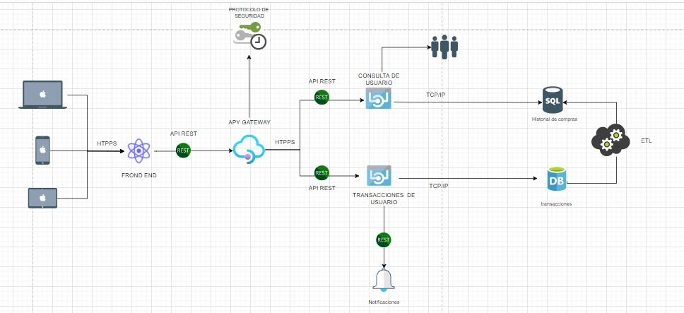

### Justificación
Arquitectura orientada a micro servicios: permite la integración continua

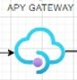

API Gateway: Encargado de gestionar el tráfico de de los datos

API rest:Conexión cliente servidor usando HTTPS el protocolo de comunicación y la estructura REST

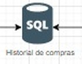

Historial de compras: En esta base de datos se almacenará el histórico de compras de los usuarios, y los gastos que ha generado

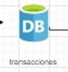

Transacciones: En esta base de datos se almacenarán el historial de compras, la intención es que sea NO SQL para actualizar los datos lo más rápido posible

ETL: extracción, transformación y carga de los datos

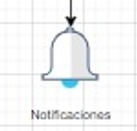

Notificaciones: Microservicio encargado de enviar notificaciones y a usuarios con la actualización de sus reportes

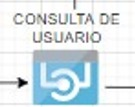

BACK END DE CONSULTA: Se encarga de mostrar al usuario el estado de cuenta, o de informarle cambios de la aplicación.

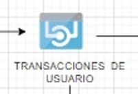

BACK END TRANSACIONAL: se encarga de las recargas y de los pagos 

PROTOCOLO DE SEGURIDAD: se encarga de guardar datos, contraseñas, numero de tarjeta, y de tener una medida preventiva y mucha seguridad 
# Plataformas tecnologicas

## Front end

Usaremos react:
En nuestro proyecto usaremos react, para tener varias ventajas como: desarrollo rentable, entregas mas rápidas
de proyectos de aplicaciones(nuestro proyecto es un aplicación básicamente), nosotros buscamos que 
nuestra aplicacion sea amigable con los usuarios que entran y que tenga un excelente rendimiento a
la hora de operar, en react se han creado aplicaciones como Facebook shopify, discord, aplicaciones
que interactuan muy bien con sus usuarios y muy sencillas de usar, JavaScript es el lenguaje que se usa
ya que react es una biblioteca de JS. ayuda a crear interfaces de usuario interactivas de forma sencilla
diseña vistas simples para cada estado en la aplicación ya que react se encargara de actualizar y renderizar
de manera eficiente los componentes correctos cuando los datos cambien.

## Back end

Utilizaremos .NET Core porque es la plataforma que vemos mas viables para poner en manos nuestro proyecto, aparte .NET Core es multiplataformas y nos sirve demasiado porque buscamos que nuestra página web pueda ser ejecutada desde diferentes sistemas operativo. También podemos hacer combinación de tecnologías, proporciona una gran experiencia en el desarrollo y tiene muchas extensiones. Su rendimiento nos favorece y nos permite que los tiempos de respuestas sean muy rápidos y se requiera menos potencia. Da mucha confianza y es seguro. Además tiene muy buen soporte y se actualiza varias veces al año para mayor seguridad y confiabilidad.

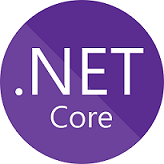

## Fuente de información
Utilizaremos MySQL debido a sus ventajas como que es una base de datos muy rápida. Su rendimiento es muy bueno sin añadirle ninguna funcionalidad avanzada. Es muy segura, pues utiliza varias capas de seguridad. Contraseñas encriptada y derechos de acceso. tiene pocos requerimientos y eficiencia de memoria. Tiene una baja fuga de memoria y necesita pocos recursos de CPU o RAM

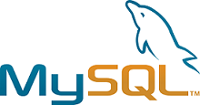

## Proveedor de identidad

Para mantener seguro nuestra aplicación usaremos OAuth 2.0 es un estándar de seguridad donde le damos a una aplicación permiso para acceder a los datos en otra aplicación, pero en vez de darle el usuario y la contraseña se maneja a través de claves que le da permisos específicos para acceder a los datos o hacer cosas a su nombre, para eso se da la autorización a la aplicación y lo que es mas importante se puede revocar esa autorización cuando se quiera

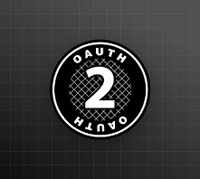

## Notificaciones
Para enviar notificaciones utlizaremos Firebase Cloud Messaging (FCM) porque nos proporciona una conexión confiable y de bajo consumo de batería entre nuestro servidor y los dispositivos, lo que te permite enviar y recibir mensajes y notificaciones en Android, iOS y la Web sin costo

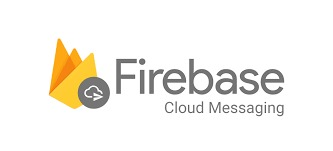

# 

# Vistas
[Vista Funcional ](md/vistaFuncional.md)

[Vista lógica](md/vistaLogica.md)

[Vista Implementación](md/vistaImplementacion.md)

[Vista Procesos](md/vistaProcesos.md)

[Vista Física](md/vistaFisica.md)

